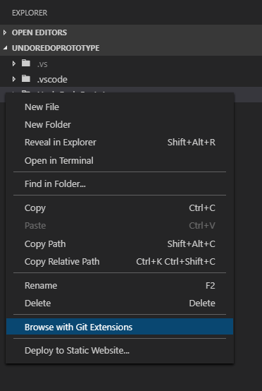

# Git Extensions for VS Code

This extension provides a command to browse the current project using GitExtensions, from the Explorer.

## Features

From the Explorer, when you right-click (anywhere; a file or not) and then select the `Browse with Git Extensions`, Git Extensions will open in `Browse` mode for your current project.

## Requirements

1. You need to have Git Extensions installed
1. Git Extensions must be available globally (for windows users: registered in the `PATH` environment variable)

## Extension Settings

There are no settings at this point.

## Known Issues

There are no known issues.

## Release Notes

### 1.0.0

The initial release of _Git Extensions for VS Code_, it contributes the `Browse with Git Extensions` command to the explorer's context menu.

### 1.0.1

Update the `vscode` dependency to `^1.1.22` to remove the `event-stream` vulnerability.
