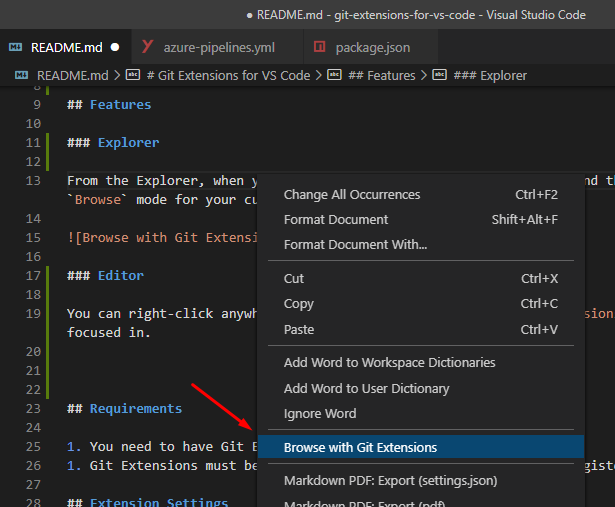

# Git Extensions for VS Code

This extension provides a command to browse the current project using GitExtensions, from the Explorer and the Editor. It also support Workspaces.

## Features

### Explorer

From the Explorer, when you right-click (anywhere; a file or not) and then select the `Browse with Git Extensions`, Git Extensions will open in `Browse` mode for your current project.

### Editor

You can right-click anywhere in an editor to `Browse with Git Extensions`. Git Extensions will then open in `Browse` mode, based on the file you are focused in.

### Compatibility

The extension works with single files, folders, and workspaces.

## Requirements

1. You need to have Git Extensions installed
1. Git Extensions must be available globally (for Windows users: registered in the `PATH` environment variable)

> Git Extensions should register itself in the `PATH` (checkbox during the installation process).
> If it did not and you need to manually add a variable to your `PATH`, I wrote the following article about that: [How to add your PHP runtime directory to your Windows 10 PATH environment variable](https://www.forevolve.com/en/articles/2016/10/27/how-to-add-your-php-runtime-directory-to-your-windows-10-path-environment-variable/). Just change `...\php.exe` with `C:\Program Files (x86)\GitExtensions\GitExtensions.exe`.

## Extension Settings

There are no settings at this point.

## Known Issues

-   The command does not work from the command palette (`ctrl+shift+p`). For more info, please take a look at the following issue on GitHub [Also work with keyboard nav](https://github.com/ForEvolve/git-extensions-for-vs-code/issues/7).

## Release Notes

### 1.1.3

-   Update packages
-   Update README
-   Update build definition
-   Fix [WS-2019-0310](https://github.com/TooTallNate/node-https-proxy-agent/commit/36d8cf509f877fa44f4404fce57ebaf9410fe51b)
-   Fix [CVE-2020-7598](https://github.com/advisories/GHSA-vh95-rmgr-6w4m)

### 1.1.1-1.1.2

-   Update the `vscode` dependency to `^1.1.33` to remove a `tar` vulnerability; see [CVE-2018-20834](https://nvd.nist.gov/vuln/detail/CVE-2018-20834).

### 1.1.0

#### Explorer context menu

-   Added support for workspace; the right-clicked context menu item is now taken into consideration, opening GitExt based on that file or directory.
-   Moved the `Browse with Git Extensions` option up, right under the navigation section.

#### Editor context menu

-   Added the `Browse with Git Extensions` command to the context menu of the editor, allowing to open GitExt from an opened file.

### 1.0.1

Update the `vscode` dependency to `^1.1.22` to remove the `event-stream` vulnerability.

### 1.0.0

The initial release of _Git Extensions for VS Code_, it contributes the `Browse with Git Extensions` command to the explorer's context menu.
